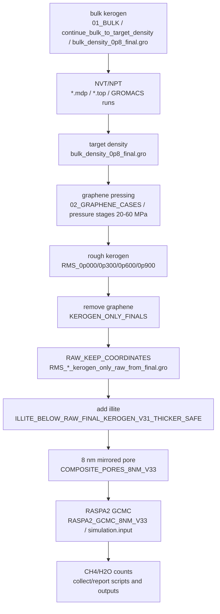

# Workflow Graph

Static audit graph. Coordinates and production outputs were not modified.

## 8nm mirrored pore

- `COMPOSITE_PORES_4NM_V32/RMS_0p000/RMS_0p000_pore_build_report.json`: ACTIVE (JSON)
- `COMPOSITE_PORES_4NM_V32/RMS_0p300/RMS_0p300_pore_build_report.json`: ACTIVE (JSON)
- `COMPOSITE_PORES_4NM_V32/RMS_0p600/RMS_0p600_pore_build_report.json`: ACTIVE (JSON)
- `COMPOSITE_PORES_4NM_V32/RMS_0p900/RMS_0p900_pore_build_report.json`: ACTIVE (JSON)
- `COMPOSITE_PORES_8NM_V33/RMS_0p000/RMS_0p000_pore_build_report.json`: ACTIVE (JSON)
- `COMPOSITE_PORES_8NM_V33/RMS_0p300/RMS_0p300_pore_build_report.json`: ACTIVE (JSON)
- `COMPOSITE_PORES_8NM_V33/RMS_0p600/RMS_0p600_pore_build_report.json`: ACTIVE (JSON)
- `COMPOSITE_PORES_8NM_V33/RMS_0p900/RMS_0p900_pore_build_report.json`: ACTIVE (JSON)

## RASPA2 GCMC

- `01_SCRIPTS/build_4nm_mirrored_pore.py`: ACTIVE (Python)
- `01_SCRIPTS/build_8nm_mirrored_pore.py`: ACTIVE (Python)
- `01_SCRIPTS/collect_gcmc_counts.py`: UNKNOWN (Python)
- `01_SCRIPTS/diagnose_raspa2_wsl_v34.py`: SUPERSEDED (Python)
- `01_SCRIPTS/diagnose_raspa2_wsl_v35.py`: SUPERSEDED (Python)
- `01_SCRIPTS/diagnose_raspa2_wsl_v36.py`: UNKNOWN (Python)
- `01_SCRIPTS/prepare_raspa2_gcmc.py`: UNKNOWN (Python)
- `01_SCRIPTS/run_raspa2_cases.py`: UNKNOWN (Python)
- `01_SCRIPTS/wsl_raspa_utils_v36.py`: UNKNOWN (Python)
- `43_BUILD_4NM_COMPOSITE_PORES.bat`: UNKNOWN (Windows BAT)
- `44_PREPARE_RASPA2_GCMC.bat`: UNKNOWN (Windows BAT)
- `45_RUN_RASPA2_GCMC.bat`: UNKNOWN (Windows BAT)
- `46_COLLECT_GCMC_COUNTS.bat`: UNKNOWN (Windows BAT)
- `47_ALL_BUILD_PREP_RUN_COLLECT.bat`: UNKNOWN (Windows BAT)
- `48_BUILD_8NM_COMPOSITE_PORES.bat`: ACTIVE (Windows BAT)
- `49_PREPARE_RASPA2_GCMC_8NM.bat`: ACTIVE (Windows BAT)
- `4nm_pore_raspa2_config.json`: ACTIVE (JSON)
- `50_RUN_RASPA2_GCMC_8NM.bat`: UNKNOWN (Windows BAT)
- `51_COLLECT_GCMC_COUNTS_8NM.bat`: ACTIVE (Windows BAT)
- `52_ALL_8NM_BUILD_PREP_RUN_COLLECT.bat`: UNKNOWN (Windows BAT)
- `53_DIAGNOSE_RASPA2_WSL_V34.bat`: UNKNOWN (Windows BAT)
- `54_PREPARE_RASPA2_GCMC_8NM_V34.bat`: UNKNOWN (Windows BAT)
- `55_RUN_RASPA2_GCMC_8NM_V34_WSL.bat`: UNKNOWN (Windows BAT)
- `56_DIAGNOSE_RASPA2_WSL_V35_ENCODING_SAFE.bat`: UNKNOWN (Windows BAT)
- `57_PREPARE_RASPA2_GCMC_8NM_V35_ENCODING_SAFE.bat`: UNKNOWN (Windows BAT)
- `58_RUN_RASPA2_GCMC_8NM_V35_WSL_ENCODING_SAFE.bat`: UNKNOWN (Windows BAT)
- `59_COLLECT_GCMC_COUNTS_8NM_V35.bat`: UNKNOWN (Windows BAT)
- `60_DIAGNOSE_RASPA2_WSL_V36_AUTODISCOVER.bat`: UNKNOWN (Windows BAT)
- `61_PREPARE_RASPA2_GCMC_8NM_V36_AUTODISCOVER.bat`: UNKNOWN (Windows BAT)
- `62_RUN_RASPA2_GCMC_8NM_V36_WSL.bat`: UNKNOWN (Windows BAT)
- `63_COLLECT_GCMC_COUNTS_8NM_V36.bat`: UNKNOWN (Windows BAT)
- `64_ALL_8NM_GCMC_V36.bat`: UNKNOWN (Windows BAT)
- `8nm_pore_raspa2_config.json`: ACTIVE (JSON)
- `BLOCKERS.md`: UNKNOWN (Markdown)
- `CHANGELOG.md`: UNKNOWN (Markdown)
- `GITHUB_WORKFLOW.md`: UNKNOWN (Markdown)
- `PROJECT_HISTORY.md`: ACTIVE (Markdown)
- `RASPA2_WSL_DIAGNOSTIC_V35.txt`: SUPERSEDED (Text)
- `RASPA2_WSL_DIAGNOSTIC_V36.txt`: UNKNOWN (Text)
- `README.md`: ACTIVE (Markdown)

## RAW kerogen extraction

- `01_SCRIPTS/extract_kerogen_only_from_final.py`: ACTIVE (Python)
- `27_BUILD_RUN_RMS0_ONLY_NT8.bat`: ACTIVE (Windows BAT)
- `28_RUN_ALL_RMS0_0300_0600_0900_FROM_SCRATCH_NT8.bat`: ACTIVE (Windows BAT)
- `30_EXTRACT_KEROGEN_ONLY_FROM_ALL_FINALS.bat`: ACTIVE (Windows BAT)
- `31_EXTRACT_KEROGEN_ONLY_EXISTING_0300_0600_0900.bat`: ACTIVE (Windows BAT)
- `KEROGEN_ONLY_FINALS/kero.itp`: DUPLICATE (GROMACS ITP)
- `KEROGEN_ONLY_FINALS/kero.top`: DUPLICATE (GROMACS TOP)
- `KEROGEN_ONLY_FINALS/kero_ATP.itp`: DUPLICATE (GROMACS ITP)

## bulk density

- `01_BUILD_BULK_0P1.bat`: UNKNOWN (Windows BAT)
- `01_BULK/01_INITIAL/kero.itp`: DUPLICATE (GROMACS ITP)
- `01_BULK/01_INITIAL/kero_ATP.itp`: DUPLICATE (GROMACS ITP)
- `01_BULK/01_INITIAL/topol.top`: DUPLICATE (GROMACS TOP)
- `01_BULK/02_MDP/00_em.mdp`: UNKNOWN (GROMACS MDP)
- `01_BULK/03_RUN/kero.itp`: DUPLICATE (GROMACS ITP)
- `01_BULK/03_RUN/kero_ATP.itp`: DUPLICATE (GROMACS ITP)
- `01_BULK/03_RUN/topol.top`: DUPLICATE (GROMACS TOP)
- `01_SCRIPTS/prepare_bulk.py`: UNKNOWN (Python)
- `02_RUN_BULK_TO_0P8.bat`: UNKNOWN (Windows BAT)

## graphene pressing

- `01_BULK/02_MDP/01_nvt_01_300K.mdp`: UNKNOWN (GROMACS MDP)
- `01_BULK/02_MDP/01_nvt_02_600K.mdp`: UNKNOWN (GROMACS MDP)
- `01_BULK/02_MDP/01_nvt_03_900K.mdp`: UNKNOWN (GROMACS MDP)
- `01_BULK/02_MDP/02_npt_compress_001_100MPa.mdp`: DUPLICATE (GROMACS MDP)
- `01_BULK/02_MDP/02_npt_compress_002_100MPa.mdp`: DUPLICATE (GROMACS MDP)
- `01_BULK/02_MDP/02_npt_compress_003_100MPa.mdp`: DUPLICATE (GROMACS MDP)
- `01_BULK/02_MDP/02_npt_compress_004_100MPa.mdp`: DUPLICATE (GROMACS MDP)
- `01_BULK/02_MDP/02_npt_compress_005_100MPa.mdp`: DUPLICATE (GROMACS MDP)
- `01_BULK/02_MDP/02_npt_compress_006_100MPa.mdp`: DUPLICATE (GROMACS MDP)
- `01_BULK/02_MDP/02_npt_compress_007_100MPa.mdp`: DUPLICATE (GROMACS MDP)
- `01_BULK/02_MDP/02_npt_compress_008_60MPa.mdp`: DUPLICATE (GROMACS MDP)
- `01_BULK/02_MDP/02_npt_compress_009_60MPa.mdp`: DUPLICATE (GROMACS MDP)
- `01_BULK/02_MDP/02_npt_compress_010_60MPa.mdp`: DUPLICATE (GROMACS MDP)
- `01_BULK/02_MDP/02_npt_compress_011_60MPa.mdp`: DUPLICATE (GROMACS MDP)
- `01_BULK/02_MDP/02_npt_compress_012_60MPa.mdp`: DUPLICATE (GROMACS MDP)
- `01_BULK/02_MDP/02_npt_compress_013_60MPa.mdp`: DUPLICATE (GROMACS MDP)
- `01_BULK/02_MDP/02_npt_compress_014_60MPa.mdp`: DUPLICATE (GROMACS MDP)
- `01_BULK/02_MDP/02_npt_compress_015_40MPa.mdp`: DUPLICATE (GROMACS MDP)
- `01_BULK/02_MDP/02_npt_compress_016_40MPa.mdp`: DUPLICATE (GROMACS MDP)
- `01_BULK/02_MDP/02_npt_compress_017_40MPa.mdp`: DUPLICATE (GROMACS MDP)
- `01_BULK/02_MDP/02_npt_compress_018_40MPa.mdp`: DUPLICATE (GROMACS MDP)
- `01_BULK/02_MDP/02_npt_compress_019_40MPa.mdp`: DUPLICATE (GROMACS MDP)
- `01_BULK/02_MDP/02_npt_compress_020_40MPa.mdp`: DUPLICATE (GROMACS MDP)
- `01_BULK/02_MDP/02_npt_compress_021_40MPa.mdp`: DUPLICATE (GROMACS MDP)
- `01_BULK/02_MDP/02_npt_compress_022_40MPa.mdp`: DUPLICATE (GROMACS MDP)
- `01_BULK/02_MDP/02_npt_compress_023_25MPa.mdp`: DUPLICATE (GROMACS MDP)
- `01_BULK/02_MDP/02_npt_compress_024_25MPa.mdp`: DUPLICATE (GROMACS MDP)
- `01_BULK/02_MDP/02_npt_compress_025_25MPa.mdp`: DUPLICATE (GROMACS MDP)
- `01_BULK/02_MDP/02_npt_compress_026_25MPa.mdp`: DUPLICATE (GROMACS MDP)
- `01_BULK/02_MDP/02_npt_compress_027_25MPa.mdp`: DUPLICATE (GROMACS MDP)
- `01_BULK/02_MDP/02_npt_compress_028_25MPa.mdp`: DUPLICATE (GROMACS MDP)
- `01_BULK/02_MDP/02_npt_compress_029_15MPa.mdp`: DUPLICATE (GROMACS MDP)
- `01_BULK/02_MDP/02_npt_compress_030_15MPa.mdp`: DUPLICATE (GROMACS MDP)
- `01_BULK/02_MDP/02_npt_compress_031_15MPa.mdp`: DUPLICATE (GROMACS MDP)
- `01_BULK/02_MDP/02_npt_compress_032_15MPa.mdp`: DUPLICATE (GROMACS MDP)
- `01_BULK/02_MDP/02_npt_compress_033_15MPa.mdp`: DUPLICATE (GROMACS MDP)
- `01_BULK/02_MDP/02_npt_compress_034_10MPa.mdp`: DUPLICATE (GROMACS MDP)
- `01_BULK/02_MDP/02_npt_compress_035_10MPa.mdp`: DUPLICATE (GROMACS MDP)
- `01_BULK/02_MDP/02_npt_compress_036_10MPa.mdp`: DUPLICATE (GROMACS MDP)
- `01_BULK/02_MDP/02_npt_compress_037_10MPa.mdp`: DUPLICATE (GROMACS MDP)

## illite wall

- `00_INPUT/illite.itp`: DUPLICATE (GROMACS ITP)
- `00_INPUT/illite.top`: DUPLICATE (GROMACS TOP)
- `00_INPUT/illite_ATP.itp`: DUPLICATE (GROMACS ITP)
- `01_SCRIPTS/add_illite_below_raw_final_kerogen_v30.py`: SUPERSEDED (Python)
- `01_SCRIPTS/add_illite_below_raw_final_kerogen_v31.py`: ACTIVE (Python)
- `01_SCRIPTS/build_illite_under_kerogen.py`: ACTIVE (Python)
- `24_BUILD_ILLITE_UNDER_KEROGEN_ALL.bat`: UNKNOWN (Windows BAT)
- `41_BUILD_THICKER_ILLITE_BELOW_RAW_FINAL_KEROGEN_ALL_V31.bat`: ACTIVE (Windows BAT)
- `42_BUILD_THICKER_ILLITE_BELOW_RAW_FINAL_KEROGEN_ONE_V31.bat`: ACTIVE (Windows BAT)
- `ILLITE_BELOW_RAW_FINAL_KEROGEN_V31_THICKER_SAFE/00_INPUT_FORCEFIELD_COPY/PUT_kero_ATP.itp_HERE.txt`: DUPLICATE (Text)
- `ILLITE_BELOW_RAW_FINAL_KEROGEN_V31_THICKER_SAFE/00_INPUT_FORCEFIELD_COPY/illite.itp`: DUPLICATE (GROMACS ITP)
- `ILLITE_BELOW_RAW_FINAL_KEROGEN_V31_THICKER_SAFE/00_INPUT_FORCEFIELD_COPY/illite.top`: DUPLICATE (GROMACS TOP)
- `ILLITE_BELOW_RAW_FINAL_KEROGEN_V31_THICKER_SAFE/00_INPUT_FORCEFIELD_COPY/illite_ATP.itp`: DUPLICATE (GROMACS ITP)
- `ILLITE_BELOW_RAW_FINAL_KEROGEN_V31_THICKER_SAFE/00_INPUT_FORCEFIELD_COPY/kero.itp`: DUPLICATE (GROMACS ITP)
- `ILLITE_BELOW_RAW_FINAL_KEROGEN_V31_THICKER_SAFE/00_INPUT_FORCEFIELD_COPY/kero.top`: DUPLICATE (GROMACS TOP)
- `ILLITE_BELOW_RAW_FINAL_KEROGEN_V31_THICKER_SAFE/00_INPUT_FORCEFIELD_COPY/kero_ATP.itp`: DUPLICATE (GROMACS ITP)
- `ILLITE_BELOW_RAW_FINAL_KEROGEN_V31_THICKER_SAFE/RMS_0p000/RMS_0p000_build_report.json`: ACTIVE (JSON)
- `ILLITE_BELOW_RAW_FINAL_KEROGEN_V31_THICKER_SAFE/RMS_0p000/illite.itp`: DUPLICATE (GROMACS ITP)
- `ILLITE_BELOW_RAW_FINAL_KEROGEN_V31_THICKER_SAFE/RMS_0p300/RMS_0p300_build_report.json`: ACTIVE (JSON)
- `ILLITE_BELOW_RAW_FINAL_KEROGEN_V31_THICKER_SAFE/RMS_0p300/illite.itp`: DUPLICATE (GROMACS ITP)
- `ILLITE_BELOW_RAW_FINAL_KEROGEN_V31_THICKER_SAFE/RMS_0p600/RMS_0p600_build_report.json`: ACTIVE (JSON)
- `ILLITE_BELOW_RAW_FINAL_KEROGEN_V31_THICKER_SAFE/RMS_0p600/illite.itp`: DUPLICATE (GROMACS ITP)
- `ILLITE_BELOW_RAW_FINAL_KEROGEN_V31_THICKER_SAFE/RMS_0p900/RMS_0p900_build_report.json`: ACTIVE (JSON)
- `ILLITE_BELOW_RAW_FINAL_KEROGEN_V31_THICKER_SAFE/RMS_0p900/illite.itp`: DUPLICATE (GROMACS ITP)
- `README_V30_THICKER_ILLITE.md`: ACTIVE (Markdown)
- `README_V31_THICKER_ILLITE_SAFE.md`: ACTIVE (Markdown)
- `docs/provenance/WATER_MODEL_REPORT.md`: UNKNOWN (Markdown)
- `illite_below_exact_final_kerogen_v28_config.json`: ACTIVE (JSON)
- `illite_below_raw_final_kerogen_v29_config.json`: SUPERSEDED (JSON)
- `illite_below_raw_final_kerogen_v30_config.json`: SUPERSEDED (JSON)
- `illite_below_raw_final_kerogen_v31_config.json`: ACTIVE (JSON)
- `illite_under_kerogen_config.json`: ACTIVE (JSON)

## rough surface

- `01_SCRIPTS/analyze_rough_surface.py`: ACTIVE (Python)
- `01_SCRIPTS/build_graphene_cases.py`: ACTIVE (Python)
- `01_SCRIPTS/build_quartz_under_kerogen.py`: ACTIVE (Python)
- `01_SCRIPTS/continue_case_after_stage.py`: ACTIVE (Python)
- `01_SCRIPTS/export_view_groups.py`: ACTIVE (Python)
- `01_SCRIPTS/extract_standard_kerogen_plate.py`: ACTIVE (Python)
- `01_SCRIPTS/generate_wall_mdps.py`: UNKNOWN (Python)
- `01_SCRIPTS/gro_tools.py`: UNKNOWN (Python)
- `02_GRAPHENE_CASES/GRAPHENE_BUILD_REPORT.json`: ACTIVE (JSON)
- `02_GRAPHENE_CASES/RMS_0p000/00_INITIAL/GBOT.itp`: DUPLICATE (GROMACS ITP)
- `02_GRAPHENE_CASES/RMS_0p000/00_INITIAL/GBOT_posre_fixed.itp`: DUPLICATE (GROMACS ITP)
- `02_GRAPHENE_CASES/RMS_0p000/00_INITIAL/GTOP.itp`: DUPLICATE (GROMACS ITP)
- `02_GRAPHENE_CASES/RMS_0p000/00_INITIAL/GTOP_posre_full.itp`: DUPLICATE (GROMACS ITP)
- `02_GRAPHENE_CASES/RMS_0p000/00_INITIAL/GTOP_posre_pull.itp`: DUPLICATE (GROMACS ITP)
- `02_GRAPHENE_CASES/RMS_0p000/00_INITIAL/GXMN.itp`: DUPLICATE (GROMACS ITP)
- `02_GRAPHENE_CASES/RMS_0p000/00_INITIAL/GXMN_posre_fixed.itp`: DUPLICATE (GROMACS ITP)
- `02_GRAPHENE_CASES/RMS_0p000/00_INITIAL/GXMX.itp`: DUPLICATE (GROMACS ITP)
- `02_GRAPHENE_CASES/RMS_0p000/00_INITIAL/GXMX_posre_fixed.itp`: DUPLICATE (GROMACS ITP)
- `02_GRAPHENE_CASES/RMS_0p000/00_INITIAL/GYMN.itp`: DUPLICATE (GROMACS ITP)
- `02_GRAPHENE_CASES/RMS_0p000/00_INITIAL/GYMN_posre_fixed.itp`: DUPLICATE (GROMACS ITP)
- `02_GRAPHENE_CASES/RMS_0p000/00_INITIAL/GYMX.itp`: DUPLICATE (GROMACS ITP)
- `02_GRAPHENE_CASES/RMS_0p000/00_INITIAL/GYMX_posre_fixed.itp`: DUPLICATE (GROMACS ITP)
- `02_GRAPHENE_CASES/RMS_0p000/00_INITIAL/kero.itp`: DUPLICATE (GROMACS ITP)
- `02_GRAPHENE_CASES/RMS_0p000/00_INITIAL/kero_ATP.itp`: DUPLICATE (GROMACS ITP)
- `02_GRAPHENE_CASES/RMS_0p000/00_INITIAL/topol.top`: DUPLICATE (GROMACS TOP)
- `02_GRAPHENE_CASES/RMS_0p000/01_MDP/00_em.mdp`: DUPLICATE (GROMACS MDP)
- `02_GRAPHENE_CASES/RMS_0p000/01_MDP/01_wall_nvt_900K_3ps.mdp`: DUPLICATE (GROMACS MDP)
- `02_GRAPHENE_CASES/RMS_0p000/01_MDP/02_pull_ramp_01_20MPa.mdp`: ACTIVE (GROMACS MDP)
- `02_GRAPHENE_CASES/RMS_0p000/01_MDP/02_pull_ramp_02_40MPa.mdp`: ACTIVE (GROMACS MDP)
- `02_GRAPHENE_CASES/RMS_0p000/01_MDP/02_pull_ramp_03_60MPa.mdp`: ACTIVE (GROMACS MDP)
- `02_GRAPHENE_CASES/RMS_0p000/01_MDP/03_pull_stage_01_700K_chunk01_50ps.mdp`: ACTIVE (GROMACS MDP)
- `02_GRAPHENE_CASES/RMS_0p000/01_MDP/03_pull_stage_02_500K_chunk01_50ps.mdp`: ACTIVE (GROMACS MDP)
- `02_GRAPHENE_CASES/RMS_0p000/02_RUN/GBOT.itp`: DUPLICATE (GROMACS ITP)
- `02_GRAPHENE_CASES/RMS_0p000/02_RUN/GBOT_posre_fixed.itp`: DUPLICATE (GROMACS ITP)
- `02_GRAPHENE_CASES/RMS_0p000/02_RUN/GTOP.itp`: DUPLICATE (GROMACS ITP)
- `02_GRAPHENE_CASES/RMS_0p000/02_RUN/GTOP_posre_full.itp`: DUPLICATE (GROMACS ITP)
- `02_GRAPHENE_CASES/RMS_0p000/02_RUN/GTOP_posre_pull.itp`: DUPLICATE (GROMACS ITP)
- `02_GRAPHENE_CASES/RMS_0p000/02_RUN/GXMN.itp`: DUPLICATE (GROMACS ITP)
- `02_GRAPHENE_CASES/RMS_0p000/02_RUN/GXMN_posre_fixed.itp`: DUPLICATE (GROMACS ITP)
- `02_GRAPHENE_CASES/RMS_0p000/02_RUN/GXMX.itp`: DUPLICATE (GROMACS ITP)

## unclassified

- `00_CHECK_ENVIRONMENT.bat`: UNKNOWN (Windows BAT)
- `00_INPUT/PUT_kero_ATP.itp_HERE.txt`: DUPLICATE (Text)
- `00_INPUT/kero.top`: DUPLICATE (GROMACS TOP)
- `00_INPUT/kero_ATP.itp`: DUPLICATE (GROMACS ITP)
- `01_SCRIPTS/set_config_value.py`: UNKNOWN (Python)
- `13_COLLECT_STANDARD_PLATE_METRICS.bat`: UNKNOWN (Windows BAT)
- `postprocess_config.json`: UNKNOWN (JSON)
- `requirements.txt`: UNKNOWN (Text)
- `待定代码/新建 文本文档.txt`: EXPERIMENTAL (Text)

## water model

- `00_INPUT/H2O.itp`: ACTIVE (GROMACS ITP)
- `00_INPUT/kero.itp`: DUPLICATE (GROMACS ITP)
- `01_SCRIPTS/common.py`: UNKNOWN (Python)
